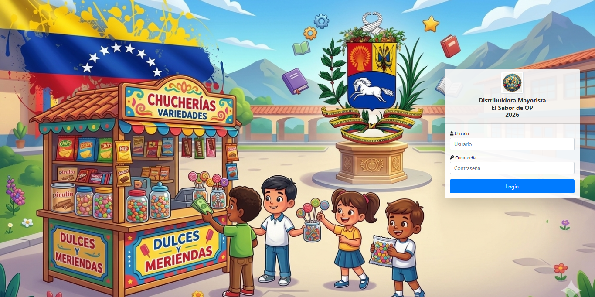

# Sistema de Inventario OP

Este es un sistema de gestión integral desarrollado para optimizar el control de ventas, la administración de productos, la cartera de clientes y el monitoreo de existencias en tiempo real.

## 🔐 Acceso al Sistema

Este módulo constituye la puerta de entrada a la plataforma. Para acceder, el usuario deberá autenticarse introduciendo sus credenciales (nombre de usuario y contraseña) en los campos correspondientes para iniciar la sesión de trabajo.

## Módulos del Sistema

A continuación se detalla cada módulo administrativo, incluyendo el espacio para visualizar su funcionamiento:

### 1. Nueva Venta
Este módulo permite el registro rápido de transacciones.

### 2. Ventas
Panel centralizado para el historial, seguimiento y gestión de todas las operaciones de venta ejecutadas.

### 3. Stock
Herramienta crítica para el control y monitoreo constante de los niveles de existencias en el inventario.

### 4. Clientes
Gestión completa de la base de datos de clientes para mantener un seguimiento de tus compradores.

### 5. Productos
Catálogo dinámico que permite la carga, edición y actualización de la información técnica de los productos.

### 6. Configuración
Panel de ajustes generales para personalizar el comportamiento y parámetros del sistema.

### 7. Usuarios
Administración de perfiles y niveles de acceso para los diferentes usuarios que operan el sistema.

### 8. Desarrollador
Sección técnica que contiene información detallada sobre el desarrollo y el autor del software.

## Usuario y clave principal del sistema

*   **Usuario**: `admin`
*   **Clave**: `admin`

Una vez dentro del sistema, podrás gestionar y actualizar el nombre de usuario, la contraseña y los roles de acceso según las necesidades de tu administración.

## 🛠️ Tecnologías y Herramientas Implementadas

El desarrollo de este sistema se fundamenta en un ecosistema robusto de tecnologías web para garantizar escalabilidad y rendimiento:

* **Entorno y Edición:** Servidor local **XAMPP** para la gestión de servicios y **Visual Studio Code** como entorno de desarrollo integrado.

* **Backend:** Implementación de **PHP 8.x**, utilizando **PDO** (*PHP Data Objects*) para garantizar una conexión segura y eficiente a la base de datos **MySQL** (`ST_database`).

* **Frontend:** Interfaz desarrollada con **HTML5**, **CSS3** y **JavaScript**, con un enfoque en diseño responsivo y adaptabilidad multiplataforma.

* **Interfaz de Usuario:** Potenciada mediante **jQuery**, **DataTables** para la manipulación avanzada de registros y **SweetAlert2** para mejorar la experiencia del usuario con alertas dinámicas.

* **Librerías Funcionales:**

    * **Generación de Reportes:** Integración de **FPDF** para la creación de documentos dinámicos.

    * **Gestión de Correo:** Implementación de **PHPMailer** para el envío automatizado de notificaciones.

* **Gestión de Recursos:** Estructura organizada de activos multimedia y archivos estáticos integrados al flujo de trabajo del proyecto.

---
* SISTEMA 100% OPERATIVO Y GRATUITO.
* Facil de usar e instalar en "XAMPP".
* Version 2.0.0

* Desarrollado por: Omar Pinto*
* Año: 2026*